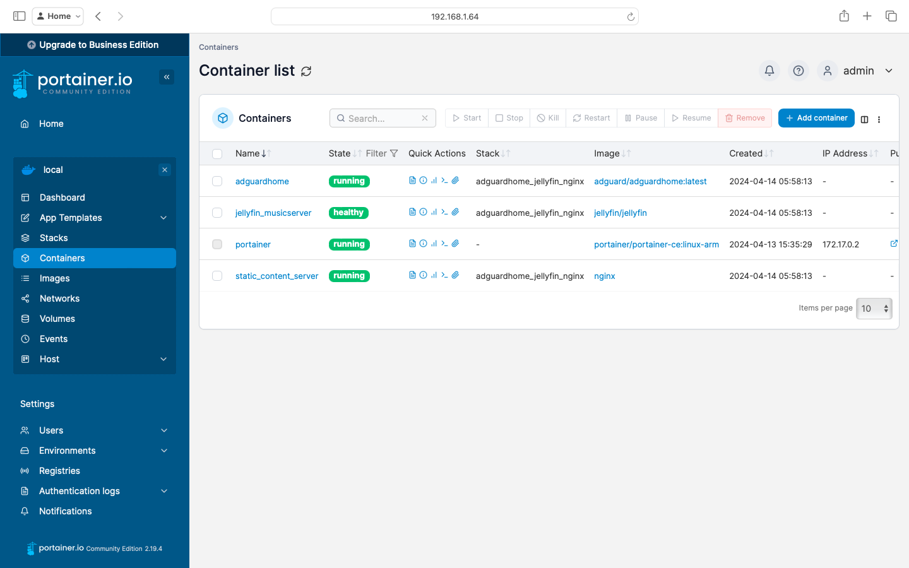
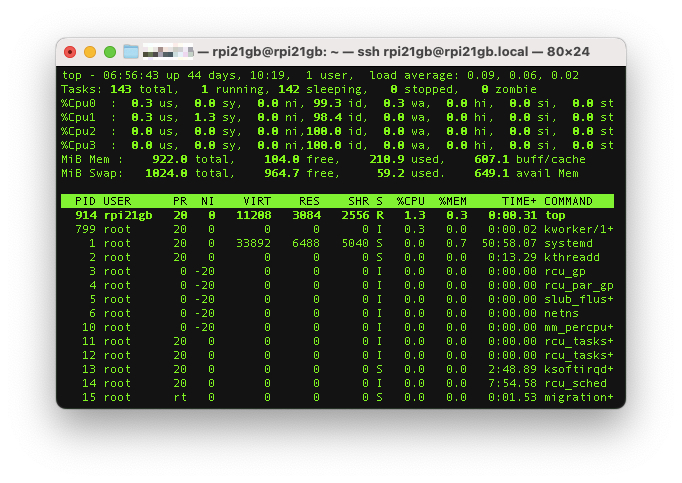

# Raspberry Pi 2 Model B 1GB RAM

**Thanks to Jim** (who lives in a beautiful neighborhood of San Jose, CA I never even knew existed) for letting me have a Raspberry Pi 2 Model B (1 GB) + 8 GB micro SD card + power supply + (wifi card, which I'm currently not using). I got in touch with Jim when I saw his post on Craigslist.

I will add  the 'why' and 'what' part later, let me just get started with the 'how' part of my usage of this Raspberry Pi.

After getting Raspberry Pi OS (Legacy, 32-bit) Lite image (with ssh enabled and a user/password created) on to micro SD card through Raspberry Pi Imager:

1) inserted the micro SD card into Raspberry Pi, connected it to my ISP-provided router with an ethernet cable, and powered it on. After waiting for a minute or so, the Pi showed up on the admin console of the router. It was given the IP address, 192.168.1.64

2) logged into Pi from a terminal on my Mac:

    ```ssh rpi21gb@192.168.1.64```

3) updated packages. (the following update / upgrade / autoremove can be run later also when the system needs to be updated with the latest Docker packages and/or other packages)

    ```
    sudo apt update && sudo apt upgrade -y && sudo apt autoremove
    ```

4) set the IP address (from step 1) above) as static IP address on Pi:
    ```
    sudo systemctl enable NetworkManager
    sudo systemctl start NetworkManager
    nmcli device show eth0
    sudo nmtui edit “Wired connection 1” # Pi / Gateway / Router IP Address are set here
    sudo shutdown -h reboot # if that doesn't work, try: sudo shutdown -r now
    ```

5) Mounted a USB drive (which till now I had on my OpenWRT router and accessible on home network through Samba) with FLAC files of my (approximately 250) audio CD collection:
    ```
    # if needed, to add, delete, or modify disk partitions
    # sudo fdisk /dev/sda and
    # sudo mkfs.ext4 /dev/sda1
    sudo mkdir /mnt/usb128gb
    sudo mount /dev/sda1 /mnt/usb128gb
    lsblk -d -fs /dev/sda1 #use info from this command in the next step
    ```

6) Using information from 'lsblk' above, added the following to /etc/fstab so that the USB drive is automatically mounted whenever a reboot occurs:
    ```
    UUID=58442e0d-2fd0-41a3-8cb1-9a321c4638e4 /mnt/usb128gb ext4 noauto,nofail,x-systemd.automount,x-systemd.idle-timeout=60,x-systemd.device-timeout=2
    ```

7) Installed and configured Samba so that the files on USB drive are accessible on home network:
    ```
    sudo apt install samba -y
    # [music]
    #    comment = All My Music
    #    path = /mnt/usb128gb/music
    #    browseable = yes
    #    read only = yes
    #    guest ok = yes
    #
    # [nobody]
    #    comment = so as to not display
    #    browseable = no
    # added above 10 lines to the end of /etc/samba/smb.conf
    vi /etc/samba/smb.conf
    sudo service smbd restart
    sudo apt install ufw -y
    sudo ufw allow samba
    ```
8) Installed Docker and Portainer (I'll be using Portainer web UI to manage Docker containers):
    ```
    curl -sSL https://get.docker.com | sh
    docker version
    sudo systemctl enable docker
    sudo usermod -aG docker rpi21gb
    sudo docker pull portainer/portainer-ce:linux-arm
    sudo docker run -d -p 9000:9000 --name=portainer --restart=always -v /var/run/docker.sock:/var/run/docker.sock -v portainer_data:/data portainer/portainer-ce:linux-arm
    ```
9) With [docker-compose.yaml](docker-compose.yaml) loaded as stack in Portainer and environment variables from [rpi2gb.env](rpi2gb.env), I now have this running on my Pi:

    

10) CPU / Memory utilization appears to be well under control for even a Pi of this vintage (released in February 2015):



11) temperature and voltage measurements look good, too.
    ```
    rpi21gb@rpi21gb:~ $ vcgencmd measure_temp
    temp=43.3'C
    rpi21gb@rpi21gb:~ $ vcgencmd measure_volts
    volt=1.2000V
    ```
12) Portainer can be upgraded later when there is a newer version:
    ```
    sudo docker stop portainer && sudo docker rm portainer && sudo docker pull portainer/portainer-ce:linux-arm && sudo docker run -d -p 9000:9000 --name=portainer --restart=always -v /var/run/docker.sock:/var/run/docker.sock -v portainer_data:/data portainer/portainer-ce:linux-arm
    ```
